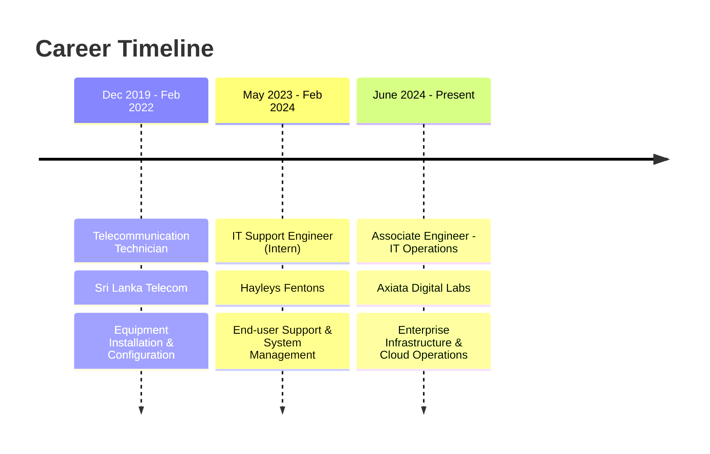

# Hi there, I'm Prabhathiya! 👋

<div align="center">
  
</div>

<div align="center">
  
  
  
</div>

---

---

## 🛠️ Tech Stack & Expertise

<div align="center">

### 💻 Operating Systems


### ☁️ Cloud & DevOps


### 🔧 Tools & Platforms


### 🔒 Security & Networking


</div>

---

## 📊 Professional Highlights

<div align="center">

| 🎯 Achievement | 📈 Impact |
|---|---|
| **Server Uptime Improvement** | 15% increase across 200+ users |
| **SLA Resolution Rate** | 95% incidents resolved within SLA |
| **Resolution Time Reduction** | 30% faster average resolution |
| **Customer Satisfaction** | 98% satisfaction score |
| **Security Enhancement** | 25% reduction in vulnerabilities |
| **Recurring Issues** | 20% reduction through proactive support |

</div>

---

## 🎓 Certifications & Education

<div align="center">

```
🎓 BSc (Hons) Network System Engineering - University of Sunderland (UK)
🏆 Higher Diploma in Network Technology & Cyber Security - Cardiff Metropolitan University (UK)
```

**Current Certifications:**
- 🟠 Oracle Cloud Infrastructure 2023 Foundation Associate (1Z0-1085-23)
- 🔒 NSE 1 & NSE 2 Network Security Associate (Fortinet)
- 🤖 AI/ML Engineering Stage 1

</div>

---

## 💼 Professional Journey

<div align="center">



</div>

---

## 🌟 Key Projects & Research

### 🏢 Network & Server Implementation with Security
> Designed and deployed secure IT infrastructure for INFO (Pvt) Ltd. branch in Sri Lanka
- **Focus**: Enterprise security architecture
- **Impact**: Robust, scalable infrastructure deployment

### 🤖 AI-driven Threat Intelligence Research  
> Developed AI-powered methods for network security threat detection and mitigation
- **Company**: Tech Secure Inc.
- **Innovation**: AI/ML integration in cybersecurity

---

## 📈 GitHub Analytics

<div align="center">
  
  
</div>

<div align="center">
  
</div>

---

## 🤝 Let's Connect!

<div align="center">

[](https://www.linkedin.com/in/deemanthan-prabhathiya)
[](mailto:deemanprabathiya119@gmail.com)
[](tel:+94711353829)

</div>

---

## 💡 Current Focus

<div align="center">

🔭 I'm currently working on **Enterprise Cloud Infrastructure Optimization**

🌱 I'm currently learning **Advanced AI/ML Engineering & Cloud Architecture**

👯 I'm looking to collaborate on **Open Source IT Operations Tools**

💬 Ask me about **System Administration, Cloud Platforms, Network Security**

⚡ Fun fact: **I handle 40+ support tickets daily while maintaining 98% customer satisfaction!**

</div>

---

<div align="center">
  
</div>

<div align="center">
  <i>⭐️ From <a href="https://github.com/deemanthan">deemanthan</a></i>
</div>

---

<div align="center">

**"Transforming IT Operations, One System at a Time"** 🚀

</div>
